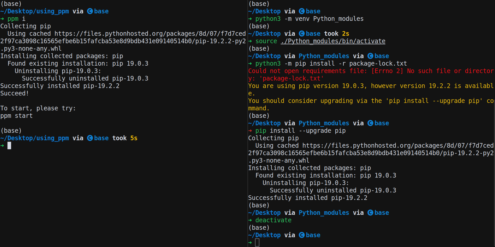

# ppm Documentation

ppm allows you to manage Python virtual environment packages as easy as using [npm](https://docs.npmjs.com/);

ppm is just a wrapper of [Python venv](https://docs.Python.org/3/library/venv.html) module and [pip](https://pypi.org/project/pip/).


[](https://github.com/Jiangyiqun/ppm/stargazers)
[](https://github.com/Jiangyiqun/ppm/network)
[](https://github.com/Jiangyiqun/ppm/issues)
<!-- [](https://github.com/Jiangyiqun/ppm) -->

## [Example](./articles/example.html)

To manage Python virtual environment, using ppm(left) is easier than traditional method(right)

[](./images/compare.png)

## [Setup](./articles/setup.html)

**bash user**

```shell
git clone https://github.com/Jiangyiqun/ppm.git && cd ppm && echo "export PATH=\"\$PATH:$(pwd)\"" >> $HOME/.bashrc && source $HOME/.bashrc
```

**zsh user**

```shell
git clone https://github.com/Jiangyiqun/ppm.git && cd ppm && echo "export PATH=\"\$PATH:$(pwd)\"" >> $HOME/.zshrc && source $HOME/.zshrc
```

## [Usage](./articles/usage.html)

```shell
USAGE: ppm <command>

ppm --version
ppm install
ppm install <package> [<package> ... <package>]
ppm start
ppm start <Python_file> [<arguments>]
ppm uninstall <package> [<package> ... <package>]
ppm upgrade
```

## [Configuration](./articles/configuration.html)

```shell
DOCS="http://ppm.jackjyq.com/"
MAIN_FILE="main.py"
DEFAULT_ARGS=""
PACKAGE_LIST="package-lock.txt"
PACKAGE_PATH="python_modules"
```

## [Logo and Badge](./articles/logo.html)

[](http://ppm.jackjyq.com/)
[](http://ppm.jackjyq.com/)